# Agentic Clinical Deterioration & Escalation Copilot

**Team 38 | Intra IIT Tech Meet 1.0 | Agentic AI Systems (Healthcare)**

An event-time clinical decision-support prototype that turns a stream of patient vital signs into an auditable, evidence-grounded escalation workflow. It maintains a patient-specific state, detects sustained multi-parameter change, fuses independent evidence, retrieves relevant protocol knowledge, and presents a prioritised recommendation for clinician review.

> This repository is a research and demonstration prototype built with synthetic patient identities and synthetic streaming data. It is not a diagnostic device and is not intended for clinical deployment.

## Highlights

- Event-time ingestion of HR, SpO2, respiratory rate, and blood pressure.
- Per-patient state, temporal history, static context, and personalised baselines.
- Trend, adaptive anomaly, and risk agents with evidence fusion.
- Online logistic-regression updates from explicit clinician labels and similar-case retrieval from experience memory.
- Local RAG over versioned clinical protocol summaries with citeable structured reasoning.
- Alert persistence, signal-quality checks, episode deduplication, and a 30-minute cooldown.
- A clinician dashboard supporting **Accept**, **Dismiss**, **Defer**, and **Investigate**, plus end-to-end audit records.
- Reproducible synthetic data generation, leakage-safe labels, and evaluation reports.

## Architecture

```mermaid
flowchart LR
    D[PhysioNet 2019 PSV files] --> F[Parameter & template fitting]
    C[Seeded config] --> P[Patient profile factory]
    F --> P
    P --> B[Personalised baseline]
    B --> T[Trajectory engine]
    T --> N[Noise & artifact injector]
    N --> V[VitalEvent JSONL]
    T --> L[Label engine]
    L --> G[Ground-truth episodes]
    P --> X[Static patient context]
    V --> KAFKA[(Kafka topic: vitals.raw)]
    X --> KAFKA2[(Kafka topic: patient.context)]
    G --> EVAL[Offline evaluator]
    KAFKA --> INGEST[Validated Kafka consumer]
    KAFKA2 --> INGEST
    INGEST --> TREND[Trend Analysis]
    TREND --> STATE[Patient State + Anomaly Learning]
    STATE --> FUSION[Risk Assessment + Evidence Fusion + Experience Memory]
    FUSION --> HANDOFF[patient.evidence]
    HANDOFF --> REASON[Clinical Knowledge Retrieval + Reasoning]
    REASON --> POLICY[Alert Policy + Clinician Review]
    POLICY --> AUDIT[Audit + clinician feedback]
    AUDIT -. feedback .-> STATE
    FILES[Generated mock cohort] -. local demo input .-> POLICY
```



Live agents receive observed events and static context only. Scenario names, latent state, and episode labels remain evaluation-only artifacts.

### Event topics and artifacts

| Stream | Kafka topic | Key | Purpose |
| --- | --- | --- | --- |
| Vital readings | `vitals.raw` | `patient_id` | Ordered, event-time patient telemetry |
| Static context | `patient.context` | `patient_id` | Compacted profile available before replay |
| Consolidated observed evidence | `patient.evidence` | `patient_id` | Trend, state, risk, fused evidence, reasoning, and citations |
| Invalid input | `vitals.dlq` | `patient_id` | Rejected JSON, schema, or quality events |
| Ground truth | `evaluation.ground_truth` | `episode_id` | Held-out labels for measuring detection and alert burden |
| Knowledge documents | RAG corpus | `document_id` | Versioned, citeable guideline snippets |

## Requirements traceability

| Challenge requirement | Implementation in this repository | Demonstrable evidence |
| --- | --- | --- |
| Process a vital stream | Kafka-compatible producer/consumer and deterministic file replay preserve event-time order | `src/ingestion/`, `clinical_data_gen.cli replay` |
| Maintain evolving patient state | `PatientStateManager` stores current vitals, temporal history, static context and individual baseline | `src/clinical_data_gen/state/` |
| Detect multi-parameter deterioration | Trend Agent evaluates concurrent and sustained change across physiological channels | `trend_agent/` and workflow output |
| Risk-score and prioritise | Risk Assessor and Evidence Fusion produce a risk level and evidence summary | `risk.py`, `fusion.py` |
| Suppress alarm fatigue | The policy requires persistence/corroboration and applies quality gates, deduplication and cooldown | `clinician_app/policy.py` |
| Ground explanations | RAG retrieves versioned protocol passages and returns structured citations | `src/clinical_reasoning/` |
| Keep clinician in the loop | Dashboard records Accept, Dismiss, Defer and Investigate actions with reasons | `clinician_app/` |
| Maintain an audit trail | Audit JSONL stores observation, evidence, citations, policy, model metadata and clinician decision | `data/evaluation/clinician_audit.jsonl` |
| Evaluate accuracy | Held-out episode labels support episode-level recall, precision, lead time and false-alert metrics | `scripts/evaluate_alert_policy.py` |

## Component design

### 1. Ingestion and event contract

Vital events are keyed by `patient_id` and use a stable envelope containing `schema_version`, `event_id`, `event_time`, `patient_id`, `run_id`, `source`, and `payload`. The payload holds observed values and a signal-quality indicator. Static context is a separate, compacted stream so that a patient's baseline and relevant history are available before live readings arrive.

The consumer validates the envelope, schema, numeric values, and chronology. Invalid input is isolated in `vitals.dlq`, rather than silently contaminating downstream state. Kafka topic contracts are:

| Topic / artifact | Key | Role |
| --- | --- | --- |
| `patient.context` | `patient_id` | Static context supplied before observations |
| `vitals.raw` | `patient_id` | Ordered, live-safe vital observations |
| `patient.evidence` | `patient_id` | Consolidated state, analysis and reasoning output |
| `vitals.dlq` | `patient_id` | Rejected malformed or poor-quality events |
| `evaluation.ground_truth` | `episode_id` | Offline-only labels for scoring |

### 2. Stateful analysis

The state manager is the common source of truth for all agents. It maintains latest values, missingness markers, a rolling history, static context and a warm-up baseline. The trend agent identifies persistent direction of change; the anomaly agent produces a state-based probability with contributing features; and the risk assessor estimates urgency. A `DeteriorationWorkflow` coordinates these agents in event-time order and makes their contracts explicit.

### 3. Evidence, clinical knowledge and explanation

Evidence Fusion combines trend, anomaly, risk and similar-case signals into a single evidence packet. `DeteriorationWorkflow` adapts this fused output through `evidence_from_p3()` and invokes the `P4Service.reason()` clinical-reasoning interface for every event. The default clinical-reasoning path uses local TF-IDF retrieval and deterministic structured reasoning; it retrieves the most relevant versioned protocol passages and returns contributing factors, cautious clinician-review action, confidence, retrieved evidence, and citations. Dense local embeddings and Groq tool-calling use the same evidence contract and can be enabled through environment configuration.

Each citation preserves the source URL, document identifier, version, locator, retrieval score and passage. This makes the reasoning path reviewable by the clinician and by an evaluator.

### 4. Escalation and feedback

The policy treats a single abnormal signal as a reason to observe, not necessarily to alert. It escalates only persistent baseline-relative change, corroborated cross-system evidence, or a high-risk trend/risk combination. Suspect-quality readings are suppressed; repeated alerts for the same episode are held during the cooldown. A clinician action is saved with the full decision context. Explicit anomaly labels can update the online learner, while all actions enrich the experience memory.

### Code reference

| Repository artifact | Main public interface | Documentation role |
| --- | --- | --- |
| `src/clinical_data_gen/generator.py` | `ClinicalDataGenerator.create()` | Builds seeded profiles, trajectories, artifacts, event streams and labels |
| `src/clinical_data_gen/schema.py` | `EventEnvelope` | Defines the stable file/Kafka transport envelope |
| `src/clinical_data_gen/state/` | `PatientStateManager.update()` | Maintains context, current state, baseline and history |
| `src/clinical_data_gen/anomaly/` | `AnomalyAgent.predict()` / `.update()` | Produces anomaly evidence and handles labelled incremental learning |
| `src/clinical_data_gen/pipeline.py` | `DeteriorationWorkflow.process_event()` | Coordinates the end-to-end event-time workflow |
| `src/risk.py`, `src/fusion.py`, `src/experience.py` | `RiskAssessor`, `EvidenceFusion`, `ExperienceMemory` | Scores severity, fuses evidence and retrieves similar reviewed cases |
| `src/clinical_reasoning/` | `P4Service.reason()` | Retrieves versioned knowledge and creates structured cited reasoning |
| `clinician_app/policy.py` | `evaluate_stream()` | Applies persistence, quality, priority and cooldown rules |
| `clinician_app/evaluation.py` | `calculate_metrics()` | Scores policy decisions against held-out episodes |

`DeteriorationWorkflow` processes every observation in a strict sequence: validate live-safe event → update patient state/baseline → trend analysis → anomaly prediction → risk assessment → similar-case retrieval → evidence fusion → knowledge-grounded reasoning → policy decision → audit record. This sequence is the central end-to-end integration contract of the project.

## Repository layout

```text
src/clinical_data_gen/    generator, schema, fitting, evaluation and workflow
src/ingestion/            Kafka producer and consumer
src/clinical_reasoning/   RAG retrieval, reasoning and evidence adapters
trend_agent/              multi-vital trend analysis
clinician_app/            dashboard, alert policy, audit and evaluation
knowledge/                versioned clinical protocol corpus
config/                   reproducible generator and reasoning configuration
scripts/                  demo and evaluation utilities
tests/                    unit, safety and workflow tests
docs/final_report.tex     final technical report source
```

## Data and scenarios

The generator fits age/sex-stratified baselines, serial dependence, residual correlation, and sepsis-onset templates from local PhysioNet Challenge 2019 data. CDC NHANES 2017--2018 HR/BP baselines provide an independent hard-negative reference. A seeded cohort includes stable and transient trajectories; monitoring artifacts; post-physiotherapy, anxiety, and ambulation cases; and sepsis-like decline, beta-blocked sepsis, opioid respiratory depression, masked hypoxemia, and haemodynamic shock.

Outputs include static context, observed event-time vitals, held-out episode windows and labels, a knowledge corpus, data-quality diagnostics, and a manifest containing run parameters and hashes.

## Quick start

Requires Python 3.10+. The default demonstration uses local TF-IDF retrieval and deterministic clinical reasoning, so it needs no API key and no embedding-model download. From the repository root:

```powershell
python -m venv .venv
.\.venv\Scripts\Activate.ps1
python -m pip install --upgrade pip
python -m pip install -e .
```

The checked-in generated cohort is ready to use. Run the dashboard with the default local reasoning path:

```powershell
$env:P4_RETRIEVAL_BACKEND = "tfidf"
$env:P4_LIVE_LLM = "false"
python clinician_app\server.py
```

Open `http://127.0.0.1:8765`. If needed, set `CLINICIAN_APP_PORT` before starting the server.

### Rebuild the cohort

Generate and validate a deterministic cohort when a fresh run is required:

```powershell
python -m clinical_data_gen.cli generate --output data/generated --patients 60 --minutes 180 --seed 20260918 --params data/derived/physionet_2019_params.json --reference data/training_setA --fidelity-max-files 1000
python -m clinical_data_gen.cli validate --input data/generated
```

### Retrieval and reasoning options

| Mode | Dependencies and configuration | Use case |
| --- | --- | --- |
| Default local | `P4_RETRIEVAL_BACKEND=tfidf`, `P4_LIVE_LLM=false` | Dependency-light, deterministic dashboard and Kafka demo |
| Dense local | `python -m pip install -e ".[p4-local]"`, `P4_RETRIEVAL_BACKEND=dense` | Local sentence-transformer embeddings and persistent SQLite vector index |
| Groq tool calling | `python -m pip install -e ".[p4-groq]"`, `P4_LIVE_LLM=true`, `GROQ_API_KEY` in the process environment | Tool-using reasoning over supplied consolidated evidence |

For dense local retrieval, build the persistent index and run the standalone reasoning demo:

```powershell
python -m pip install -e ".[p4-local]"
python scripts/build_p4_index.py
python scripts/run_p4_demo.py --retrieval dense
```

Run the automated tests:

```powershell
python -m pytest -q
```

## Demonstration

1. Start the consumer:

   ```powershell
   $env:KAFKA_BROKER = "localhost:9092"
   $env:P4_RETRIEVAL_BACKEND = "tfidf"
   $env:P4_LIVE_LLM = "false"
   python -m ingestion.consumer
   ```

2. Replay the cohort in a second terminal. Context is sent before event-time vitals; `--speed 60` maps one simulated minute to one second.

   ```powershell
   python -m ingestion.producer --input data/generated/vitals_observed.jsonl --speed 60
   ```

3. Launch the clinician interface and open `http://127.0.0.1:8765`.

   ```powershell
   python clinician_app/server.py
   ```

4. Show a noisy/transient case being suppressed, then a sustained multi-parameter episode with fused evidence, protocol citations, recommendation, clinician action, and audit record.
\
5. Produce the saved policy report:

   ```powershell
   python scripts/evaluate_alert_policy.py
   ```

For terminal-only replay, run `python -m clinical_data_gen.cli replay --input data/generated --speed 60`.

The dashboard reads the generated cohort locally; Kafka replay independently publishes the same analysed and reasoned evidence to `patient.evidence`. Both paths use the same `DeteriorationWorkflow`, clinical-reasoning service boundary, alert policy, and audit contract.

## Decision controls

| Stage | Responsibility | Guardrail |
| --- | --- | --- |
| Ingestion | Validate event schema, values and time order | Invalid messages go to a dead-letter topic |
| State | Maintain context, history and baseline | Context is registered before replay |
| Analysis | Produce trend, anomaly and risk evidence | An anomaly alone is never an alert |
| Reasoning | Fuse evidence and retrieve protocol grounding | Citations retain source/version/locator provenance |
| Alerting | Alert, defer or suppress | Persistence, quality checks, deduplication and cooldown |
| Review | Record clinician action and reason | Only explicit anomaly labels train the online model |

## Evaluation

The checked-in fixed-seed cohort contains **60 patient contexts**, **10,800 observed vital events**, and **33 labelled deterioration episodes**. The quality report records passed physiology and leakage checks. Patient-level synthetic-to-real transfer diagnostics report a 0.0122 AUROC gap for boosted stumps and a 0.0129 gap for depth-3 boosted trees; these assess data fidelity, not clinical effectiveness.

The alert-policy evaluator reports episode precision/recall, lead time, alerts per patient-hour, duplicate suppression, artifact false-positive rate, citation coverage, and audit completeness. It reads held-out labels only after runtime processing, never as agent inputs.

### Evaluation protocol

Evaluation uses patient-level splits wherever training and testing are compared, so the same patient profile cannot appear in both sets. Runtime receives `vitals_observed.jsonl` and `patient_context.jsonl`; the evaluator later compares alert windows with `ground_truth_episodes.jsonl`. This separation measures whether the workflow catches an episode early enough, rather than merely recognising a label in a static table.

| Measure | Interpretation |
| --- | --- |
| Episode recall | Fraction of labelled deterioration episodes with an alert in the onset-to-escalation window |
| Episode precision | Fraction of alert episodes overlapping a labelled deterioration interval |
| Median lead time | Time from the first qualifying alert to the labelled escalation window |
| Alerts per patient-hour | Operational alert burden on the care team |
| Duplicate suppression | Candidate repeated alerts prevented by episode/cooldown logic |
| Artifact false-positive rate | Artifact-labelled observations incorrectly escalated |
| Citation coverage | Fraction of escalations carrying retrievable supporting evidence |
| Audit completeness | Fraction of reviewed records containing required decision fields |

### Current fixed-seed cohort results

| Result | Value |
| --- | ---: |
| Patient contexts / observed events / episodes | 60 / 10,800 / 33 |
| Detected episodes | 19 |
| Episode precision / recall | 0.3684 / 0.5758 |
| Median lead time | 29.0 minutes |
| Alerts per patient-hour | 0.3687 |
| Duplicate suppression rate | 0.9143 |
| Artifact false-positive rate | 0.0 |
| Audit-record completeness | 1.0 |

These values are deterministic outputs of the checked-in cohort and evaluation artifacts. They should be presented alongside the scenario mix and operating-point policy, rather than as hospital-validation claims.

## Data outputs

```text
data/generated/
  manifest.json                 # seed, run ID, parameters and SHA-256 hashes
  patient_context.jsonl         # static profile stream
  vitals_observed.jsonl         # live-safe vital-event stream
  ground_truth_episodes.jsonl   # held-out episode onset/escalation windows
  evaluation_labels.jsonl       # held-out event-level labels and latent state
  knowledge_corpus.jsonl        # protocol corpus copied with the run
  data_quality_report.json      # invariants and fidelity diagnostics
```

The manifest makes a demonstration reproducible: it records the random seed, patient count, duration, run identifier and hashes of the configuration, fitted parameters, corpus and emitted JSONL files.

## Technical choices

- Personal baselines detect meaningful individual change and reduce population-threshold false alarms.
- Multi-agent fusion prevents any single score from unilaterally escalating a patient.
- Scenario and label separation enables credible offline evaluation without leakage.
- Versioned RAG citations make reasoning inspectable.
- A clinician action is kept distinct from a supervised anomaly label, avoiding incorrect learning from workflow choices.

## Limitations

- Synthetic-cohort results do not establish hospital-population generalisation or clinical effectiveness.
- Protocol summaries and threshold configuration require local clinical governance and validation.
- Online learning needs carefully curated outcome labels and bias monitoring.

